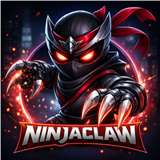

<p align="center">
  
</p>

<p align="center">
  <strong>NinjaClaw-Open</strong> — Full-featured AI agent with NinjaBrain knowledge engine.<br>
  Based on OpenClaw, with 30+ channel extensions, Web UI, and container sandboxing.<br>
  Trimmed for security — no native apps, no vendor bundles, no bloat.
</p>

<p align="center">
  Based on <a href="https://github.com/openclaw/openclaw">OpenClaw</a> · MIT License
</p>

---

## What is NinjaClaw-Open?

A personal AI agent built on OpenClaw's battle-tested gateway, with **NinjaBrain** for persistent knowledge and **Agent Lightning** for continuous prompt optimization. Supports 30+ messaging channels out of the box.

### Key Additions over OpenClaw

| Feature | OpenClaw | NinjaClaw-Open |
|---------|----------|----------------|
| **Knowledge Engine** | ❌ None | ✅ NinjaBrain (SQLite + bash CLI) |
| **Prompt Optimization** | ❌ None | ✅ Agent Lightning APO |
| **Container Sandboxing** | Opt-in (default: off) | Mandatory (default: all) |
| **Default Model** | Configurable | Claude Sonnet 4.6 via GitHub Copilot |
| **Persona** | Generic | Raiden — security-focused ninja persona |
| **Native Apps** | macOS, iOS, Android | Removed (gateway-only) |
| **Bloat** | Skills marketplace, QA lab, vendor bundles | Removed |

### Inherited from OpenClaw

These powerful features come from the upstream OpenClaw project:

- **Docker Container Sandboxing (mandatory)** — All agent shell commands run inside isolated Docker containers with filesystem bridges, workspace mounts, and tool policies. Default changed from opt-in to always-on.
- **30+ Channels** — Telegram, WhatsApp, Discord, Slack, Signal, iMessage, Teams, Matrix, and more
- **Web UI with Pairing Auth** — Secure web control panel with device pairing
- **Token/Password Gateway Auth** — Configurable gateway authentication modes
- **Plugin System** — Extensible architecture for providers, channels, and tools

## Features

Everything OpenClaw offers (minus native apps and bloat), plus:

- **NinjaBrain** — Persistent knowledge base. The agent remembers people, projects, companies, and concepts across conversations using a SQLite database with a bash CLI helper.
- **Agent Lightning APO** — Daily automatic prompt optimization based on conversation quality.
- **Raiden Persona** — Security-focused ninja identity with read-before-write code discipline and honesty rules (SOUL.md + AGENTS.md).
- **GitHub Copilot Provider** — Authenticate via GitHub Copilot for model access.

### What Was Removed

The following upstream components were removed to reduce attack surface and keep the codebase focused:

- `apps/` — macOS, iOS, and Android native applications (880 files)
- `vendor/` — Canvas UI vendor bundle (173 files)
- `skills/` — Pre-built skills marketplace (73 files)
- `qa/` — QA test lab (60 files)
- `.pi/` — Raspberry Pi device config (10 files)
- `Swabble/` — OpenClaw code contest (36 files)
- OpenClaw-specific GitHub workflows (kept only CI + CodeQL)

## Quick Start

```bash
git clone https://github.com/OfirGavish/NinjaClaw-Open.git
cd NinjaClaw-Open
pnpm install
pnpm build
```

### Configure

```bash
# Create config
mkdir -p ~/.openclaw
cat > ~/.openclaw/openclaw.json << 'EOF'
{
  "agents": {
    "defaults": {
      "model": "github-copilot/claude-sonnet-4.6"
    }
  },
  "gateway": {
    "mode": "local",
    "port": 18789
  },
  "channels": {
    "telegram": {
      "enabled": true
    }
  }
}
EOF

# Set tokens
export GITHUB_TOKEN=your_github_copilot_token
export TELEGRAM_BOT_TOKEN=your_telegram_bot_token
```

### Run

```bash
node openclaw.mjs gateway run --bind loopback --port 18789
```

## NinjaBrain

A persistent knowledge base accessible via bash inside the agent's workspace.

### Usage (inside agent)

```bash
# Search for knowledge
bash brain-cli.sh search "ofir"

# Create a knowledge page
bash brain-cli.sh put "people/ofir-gavish" "Ofir Gavish" \
    "Security expert and NinjaClaw creator" \
    "Created NinjaClaw project" "person"

# Link entities
bash brain-cli.sh link "people/ofir-gavish" "projects/ninjaclaw" "created"

# List all pages
bash brain-cli.sh list

# Get statistics
bash brain-cli.sh stats
```

### The Compounding Loop

Instructions in TOOLS.md tell the agent to:
1. **READ** — Search brain before answering about known entities
2. **RESPOND** — Use brain context for informed answers
3. **WRITE** — After learning something new → `brain put`
4. **LINK** — If two entities are related → `brain link`

## Agent Lightning

Automatic Prompt Optimization powered by [Microsoft Agent Lightning](https://github.com/microsoft/agent-lightning).

### Setup

```bash
cd agent-lightning
bash setup-agent-lightning.sh open
```

### How It Works

- Runs daily at 3 AM via cron
- Reads conversation traces from OpenClaw session JSONL files
- Runs APO beam search to optimize SOUL.md
- Outputs optimized prompt for review before applying

### Manual Run

```bash
source ~/agl-env/bin/activate
python3 optimize_prompt.py \
    --db ~/.openclaw/workspace/ninjabrain.db \
    --prompt ~/.openclaw/workspace/SOUL.md \
    --agent-type open
```

## Architecture

OpenClaw's gateway architecture with NinjaClaw additions:

```
Channels (Telegram, Discord, Slack, ...) → Gateway (WS API)
    → Agent Runtime → Tools (bash, read, write, edit, brain-cli.sh)
    → NinjaBrain DB (SQLite)
    → Agent Lightning (daily APO optimization)
```

## Workspace Files

| File | Purpose |
|------|---------|
| `SOUL.md` | NinjaClaw persona — security-focused identity |
| `AGENTS.md` | Code discipline, honesty rules, brain instructions |
| `TOOLS.md` | NinjaBrain usage instructions |
| `brain-cli.sh` | Bash helper for brain database operations |
| `ninjabrain.db` | SQLite knowledge database |

## Credits

- Based on [OpenClaw](https://github.com/openclaw/openclaw) by Peter Steinberger and community
- NinjaBrain knowledge engine by Ofir Gavish
- Prompt optimization by [Agent Lightning](https://github.com/microsoft/agent-lightning)

## License

MIT — See [LICENSE](LICENSE) for details.
